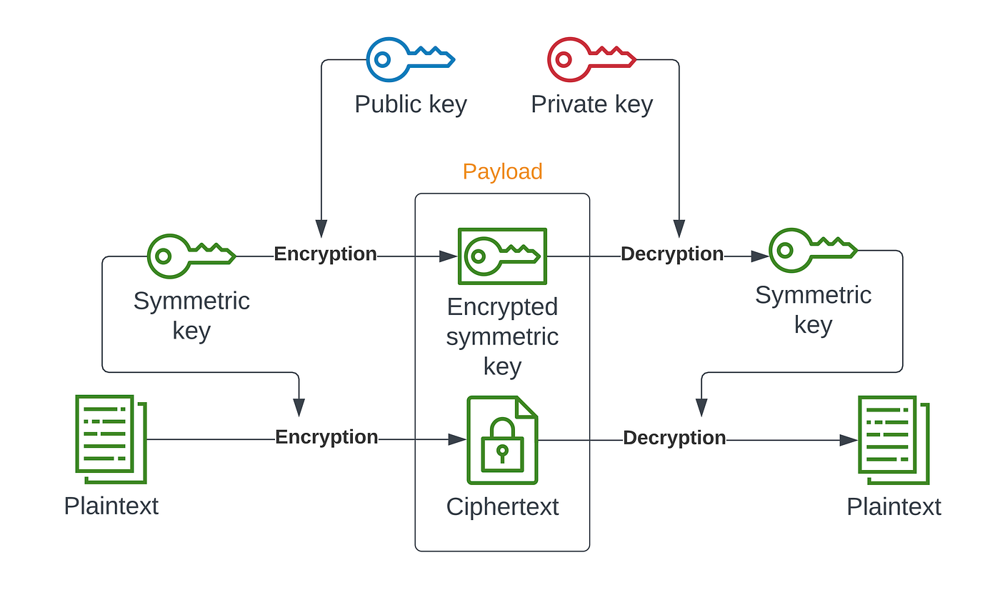

# Encryption in Chat Guard

## Overview

Our application prioritizes user privacy and security by implementing `end-to-end` encryption. This document outlines the hybrid encryption technique employed, combining both `symmetric` and `asymmetric` encryption methods.

## Hybrid Encryption Process

### Step 1: `Symmetric` Encryption

1.1 **Secret Key Creation:**

- Generate a secret key for symmetric encryption.

  1.2 **Message Encryption:**

- Encrypt the user's message using the generated secret key symmetrically.

### Step 2: `Asymmetric` Encryption

2.1 **Recipient's Public Key Retrieval:**

- Obtain the public key of the intended recipient.

  2.2 **Secret Key Encryption:**

- Encrypt the generated secret key `symmetrically` with the recipient's public key using `asymmetric` encryption.

  2.3 **Include Encrypted Secret Key:**

- Append the encrypted secret key alongside the `symmetrically` encrypted message for transmission.

### Step 3: Decryption

3.1 **Recipient's Private Key Retrieval:**

- The recipient, possessing the corresponding private key, retrieves the encrypted secret key.

  3.2 **Secret Key Decryption:**

- Decrypt the encrypted secret key `asymmetrically` using the recipient's private key, revealing the original secret key.

  3.3 **Message Decryption:**

- With the decrypted secret key, the recipient `symmetrically` decrypts the original message.

## Conclusion

By integrating both symmetric and asymmetric encryption techniques in a hybrid model, Chat Guard ensures a robust and multi-layered approach to protect user data during transmission. This methodology enhances security by combining the efficiency of symmetric encryption for bulk data with the added layer of protection provided by asymmetric encryption for secure key exchange.
