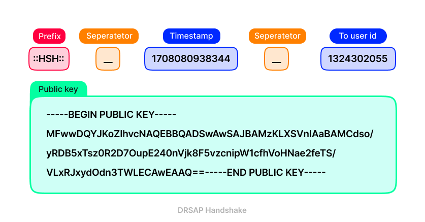
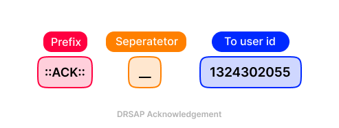
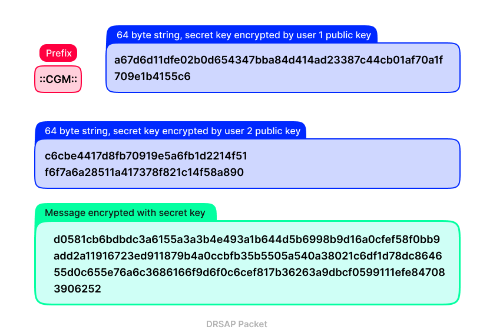

# DRSAP Encryption Documentation

## Introduction

DRSAP (Dynamic RSA Packet) is a hybrid encryption protocol designed for secure communication within your application. It employs a modified version of hybrid encryption and includes metadata in both messages and handshakes to ensure secure and efficient communication. DRSAP utilizes a two-way handshake method to exchange public keys between users and encrypts messages uniquely for each recipient.

## Overview of DRSAP Encryption

### Hybrid Encryption

DRSAP utilizes hybrid encryption, combining the strengths of symmetric and asymmetric encryption. Each message is encrypted with a unique secret key, and this secret key is then encrypted with the recipient's public key. This ensures that only the intended recipient, possessing the corresponding private key, can decrypt and access the original message.

### Metadata in Messages and Handshakes

To distinguish between handshakes and regular messages, a specific prefix is used. Handshake messages are identified by the `::HSH::` prefix, while regular encrypted messages are identified by `::cgm::`. Metadata such as timestamps and recipient user IDs are included in handshakes to enhance security and tracking.

## DRSAP Handshake Content

The DRSAP handshake consists of the following components:

1. **Prefix:** `::HSH::` to identify the message as a handshake.
2. **Separator:** `__` for separating different parts of the handshake.
3. **Timestamp:** Indicates the time of the handshake.
4. **Separator:** `__` for further separation.
5. **To User ID:** The user ID of the recipient.
6. **Public Key PEM:** The public key of the sender in PEM format.

### DRSAP Handshake Acknowledgment Content

After receiving a handshake, a client sends an acknowledgment packet containing:

1. **Prefix:** `::ACK::` to identify the message as an acknowledgment.
2. **Separator:** `__` for separating different parts of the acknowledgment.
3. **To User ID:** The user ID of the sender.

## DRSAP Encrypted Message Content

The actual encrypted message in DRSAP consists of:

1. **Prefix:** `::cgm::` to identify the message as encrypted.
2. **64-byte String:** Secret key encrypted with the recipient's public key.
3. **64-byte String:** Secret key encrypted with the sender's public key.
4. **Message:** Encrypted using the secret key.

## Conclusion

DRSAP provides a secure communication framework by combining the advantages of symmetric and asymmetric encryption. The use of unique secret keys for each message and the inclusion of metadata in handshakes enhance the overall security and reliability of communication within the application.
