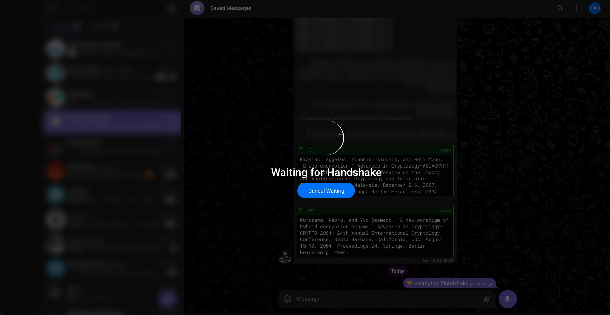
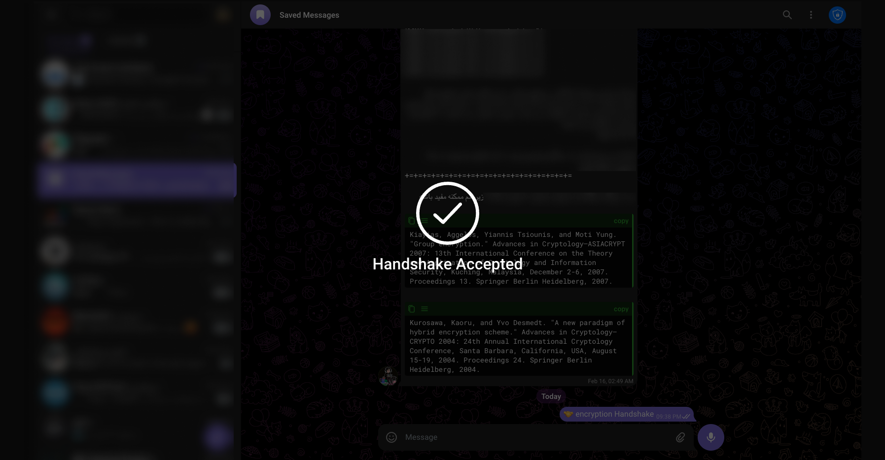

# How to Chat safely with Chat Guard.

### Prerequisites

1. **Download and Install Extension**

   - Download and install `Chat Guard` using [official documentation](/getting-started/installation)

2. **Restart Browser** <Badge type="tip" text="important" />
   - Some browsers may require a restart after installing the extension.

## How to Use and Encrypt a Conversation

Chat Guard allows users to engage in `end-to-end` encrypted conversations. Both users need to have the extension installed for secure communication.

### Initiating Secure Conversation

1. **Open Messenger**

   - Open your preferred messenger platform (e.g., Telegram, Bale,...).

2. **Click on the Lock Icon**

   - Within the messenger, locate the lock icon located in the toolbar or header.

   

3. **Initiate Handshake Process**

   - Both users must click on the lock icon simultaneously to initiate the handshake process.

   

4. **Handshake Completion**

   - Once the handshake process is completed, a confirmation message will appear, indicating that the secure connection has been established.

   

### Enjoy Freedom of Speech

Now that the handshake process is complete, users can enjoy the freedom of speech with confidence that their conversations are `End-to-End` encrypted. Chat Guard ensures a secure and private communication experience.

**Note:** It is essential that both users have the Chat Guard extension installed and follow the steps mentioned above to establish a secure connection.
